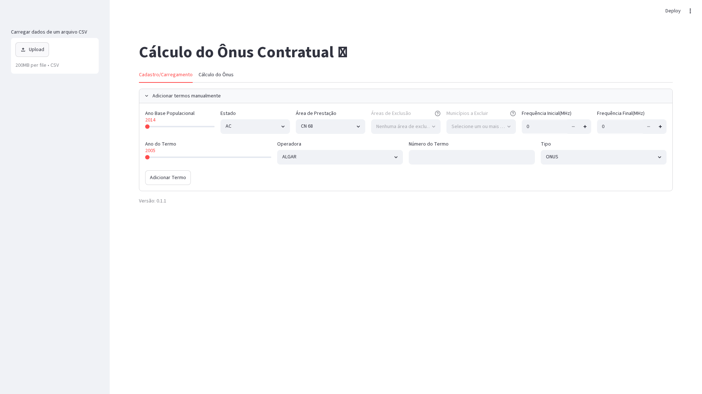

# Cálculo do Ônus Contratual

Aplicação web para cálculo do ônus contratual por município, decorrente da outorga de radiofrequência no Brasil. A ferramenta utiliza dados populacionais do IBGE e áreas de prestação de serviço de telecomunicações para distribuir proporcionalmente o ônus tributário (2% do ROL - Receita Operacional Líquida) entre os municípios contemplados pelos termos de outorga.

🔗 **Acesse a aplicação:** [https://calculo-onus.streamlit.app](https://calculo-onus.streamlit.app)

---

## 📸 Snapshot da Aplicação



---

## ✨ Funcionalidades

- **Cadastro Manual de Termos**: Interface interativa para inserir termos de outorga com seleção de ano base populacional (2014–2024), estado, área de prestação, áreas de exclusão, municípios a excluir e faixas de frequência.
- **Carregamento via CSV**: Importação em lote de termos a partir de arquivos CSV, com validação de colunas obrigatórias.
- **Edição de Termos**: Tabela editável para visualizar, excluir e gerenciar os termos cadastrados.
- **Cálculo do Ônus por Município**: Cálculo automático baseado em:
  - **Fator de Frequência**: proporção da largura de banda sobre a frequência central do termo em relação a todos os termos da mesma operadora no estado.
  - **Fator de População**: proporção da população do município sobre a população total da área de prestação.
  - **ROL da UF**: Receita Operacional Líquida aplicada ao estado (2% do ROL distribuído proporcionalmente).
- **Estatísticas do Cálculo**: Total de municípios, população total, ônus total do termo, ônus médio por município e ônus por habitante.
- **Suporte a Múltiplas Operadoras**: 18 operadoras cadastradas (Algar, Brisanet, Claro, Cloud2u, Copel, Cozani, Garliava, Ligga Telecom, Ligue, Nextel, Oi, Options, Sercomtel, Telefónica, TIM, TPA, Vivo, Winity).

---

## 🏗️ Arquitetura

A aplicação é construída em Python com Streamlit e segue uma arquitetura modular:

| Módulo | Descrição |
|--------|-----------|
| `app.py` | Entry point principal. Define a interface Streamlit com duas abas (Cadastro/Carregamento e Cálculo do Ônus) e orquestra os demais módulos. |
| `data_processor.py` | Processamento de dados. Carrega bases de população e áreas de prestação, filtra estados, municípios, aplica exclusões e gera a tabela final de termos. |
| `calculations.py` | Lógica de cálculo do ônus. Implementa a fórmula de distribuição proporcional entre municípios com base nos fatores de frequência e população. |
| `ui_components.py` | Componentes reutilizáveis de interface do usuário (formulários, controles de cálculo, filtros). |
| `utils.py` | Funções utilitárias auxiliares. |

---

## 🗂️ Dados Utilizados

- **`data/pop_2014_2024.csv`**: Base populacional do IBGE por município e por ano (2014 a 2024).
- **`data/df_Mun_UF_Area.csv`**: Mapeamento de municípios por estado e área de prestação de serviço de telecomunicações.
- **`SHP_UFs/`**: Arquivos shapefile (.shp) com os limites municipais de todas as unidades federativas brasileiras (base cartográfica IBGE).

---

## 🚀 Execução Local

### Pré-requisitos
- Python ≥ 3.13
- [uv](https://docs.astral.sh/uv/) (recomendado) ou pip

### Instalação
```bash
# Clone o repositório
git clone https://github.com/InovaFiscaliza/calculo-onus.git
cd calculo-onus

# Crie o ambiente virtual e instale as dependências
uv venv
uv pip install -r requirements.txt
```

### Executar a aplicação
```bash
uv run streamlit run app.py
```

A aplicação estará disponível em `http://localhost:8501`.

---

## 📋 Estrutura Esperada do CSV de Importação

O arquivo CSV de carga deve conter obrigatoriamente as seguintes colunas:

| Coluna | Descrição |
|--------|-----------|
| `AnoBase` | Ano de referência da base populacional |
| `Entidade` | Nome da operadora |
| `NumTermo` | Número do termo de outorga |
| `AnoTermo` | Ano de assinatura do termo |
| `UF` | Sigla do estado |
| `AreaPrestacao` | Área de prestação do serviço |
| `AreaExclusao` | Áreas a serem excluídas (separadas por vírgula) |
| `MunicipioExclusao` | Municípios a serem excluídos (separados por vírgula) |
| `FrequenciaInicial` | Frequência inicial em MHz |
| `FrequenciaFinal` | Frequência final em MHz |
| `FrequenciaCentral` | Frequência central em MHz |
| `Banda` | Largura de banda em MHz |
| `Tipo` | Tipo do termo (`ONUS` ou `DEMAIS`) |

---

## 🧮 Fórmula do Cálculo

O ônus de cada município é calculado pela seguinte fórmula:

```
Ônus Município = Fator de Frequência × Fator de População × 0.02 × ROL da UF
```

Onde:
- **Fator de Frequência** = `(BW/FreqCentral do termo) / Σ(BW/FreqCentral de todos os termos da operadora no estado)`
- **Fator de População** = `População do município / População total da área`

---

## 📝 Versão

Consulte o arquivo `pyproject.toml` para a versão atual da aplicação.

---

## 🤝 Contribuição

Contribuições são bem-vindas! Para propor melhorias ou reportar problemas, abra uma *issue* ou envie um *pull request* no repositório oficial.

---

Desenvolvido com ❤️ por **InovaFiscaliza**.
